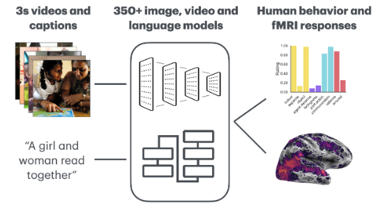

# Large-scale DNN Benchmarking in Dynamic Social Vision

This repository is the official implementation of [Dynamic social vision highlights gaps between deep
learning and human behavioral and neural responses](). 



## Requirements:

To install requirements:

```shell
conda env create -f environment.yml
```

### Additional Requirements:
This code base utilizes and was created in collaboration with an unreleased package - [Deepjuice](https://github.com/ColinConwell/DeepJuiceDev) (_Model zoology, feature extraction, GPU-accelerated brain + behavioral readout for CogNeuroAI research._)
```
@article{conwell2023pressures,
 title={What can 1.8 billion regressions tell us about the pressures shaping high-level visual representation in brains and machines},
 author={Conwell, Colin and Prince, Jacob S and Kay, Kendrick N and Alvarez, George A and Konkle, Talia},
 journal={bioRxiv},
 year={2023}
}
```

### Data Requirements:

The neural fMRI, video and preprocessing datasets are currently privately hosted.


## Running the benchmarks:

We currently have the following implemented benchmarks defined by individual Classes within the `scripts` directory:

- VisionNeuralEncoding
- VisionBehaviorEncoding
- VideoNeuralEncoding
- VideoBehaviorEncoding
- LanguageNeuralEncoding
- LanguageBehaviorEncoding
- VisionNeuralRSA
- VideoNeuralRSA

We utilize Rockfish with slurm to run sbatch jobs. In the `scripts` directory you can find pre-generated shell scripts to run the benchmarks listed above e.g.
```shell
sbatch -J {model_uid} batch_vis-neural_encoding.sh {model_uid}
```

## Results

Our benchmark contains over 350+ DNN models across Image, Video and Language models.

### [Table of the top-10 models on average across all ROIs]()

Models are arranged in descending order of their overall average performance. Bold scores highlight the model achieves the highest score in each ROI.

| Model UID                     | EVC    | MT     | EBA    | LOC    | pSTS   | aSTS   | FFA    | PPA    |
|-------------------------------|--------|--------|--------|--------|--------|--------|--------|--------|
| x3d_m                         | 0.386  | 0.427  | **0.468** | 0.335  | 0.248  | 0.264  | 0.504  | 0.500  |
| x3d_s                         | 0.391  | 0.435  | 0.430  | **0.350** | 0.241  | 0.248  | 0.499  | 0.525  |
| i3d_r50                       | 0.367  | 0.423  | 0.454  | 0.331  | 0.254  | 0.261  | 0.499  | 0.453  |
| slowfast_r50                  | 0.366  | **0.442** | 0.440  | 0.319  | 0.250  | 0.259  | 0.478  | 0.454  |
| slow_r50                      | 0.361  | 0.408  | 0.417  | 0.328  | 0.246  | 0.245  | 0.511  | 0.471  |
| beitv2_large_patch16_224      | 0.372  | 0.244  | 0.340  | 0.323  | **0.281** | 0.290  | 0.530  | 0.582  |
| c2d_r50                       | 0.372  | 0.378  | 0.397  | 0.307  | 0.260  | 0.272  | 0.506  | 0.459  |
| mixer_b16_224_miil_in21k      | **0.404** | 0.210  | 0.307  | 0.259  | 0.263  | **0.318** | **0.566** | **0.605** |
| beit_large_patch16_224        | 0.371  | 0.245  | 0.342  | 0.317  | 0.273  | 0.281  | 0.508  | 0.589  |
| beitv2_base_patch16_224       | 0.363  | 0.224  | 0.342  | 0.322  | 0.262  | 0.252  | 0.529  | 0.597  |


### [Table of the top-10 performing models averaged across features]() 

Models are arranged in descending order of their overall average performance. Bold scores highlight the model that is the top performing model for a given feature. The absence scores of a given feature (e.g., expanse) indicates that the top performing model for that feature was not in the overall top-10 models.

| Model UID                                  | expanse | object | agent distance | facingness | joint action | communication | valence | arousal |
|--------------------------------------------|---------|--------|----------------|------------|--------------|---------------|---------|---------|
| paraphrase-multilingual-MiniLM-L12-v2      | 0.723   | 0.638  | 0.590          | 0.534      | 0.650        | 0.564         | 0.693   | 0.621   |
| paraphrase-MiniLM-L6-v2                    | 0.755   | 0.624  | 0.578          | 0.438      | 0.577        | **0.619**     | 0.702   | 0.695   |
| paraphrase-multilingual-mpnet-base-v2      | 0.732   | 0.617  | 0.613          | 0.460      | 0.653        | 0.561         | 0.707   | 0.616   |
| all-mpnet-base-v2                          | 0.707   | 0.668  | 0.542          | 0.459      | **0.675**    | 0.382         | 0.719   | **0.728** |
| all-mpnet-base-v1                          | 0.724   | **0.699** | 0.590       | 0.377      | 0.644        | 0.402         | 0.718   | 0.666   |
| all-roberta-large-v1                       | 0.789   | 0.632  | 0.592          | 0.446      | 0.645        | 0.373         | 0.628   | 0.681   |
| all-distilroberta-v1                       | 0.698   | 0.601  | 0.563          | 0.455      | 0.604        | 0.389         | **0.775** | 0.612 |
| distiluse-base-multilingual-cased-v1       | 0.710   | 0.672  | 0.578          | 0.318      | 0.476        | 0.453         | 0.761   | 0.686   |
| clip_vitl14                                | 0.769   | 0.540  | **0.622**      | **0.781**  | 0.307        | 0.492         | 0.708   | 0.404   |
| all-MiniLM-L6-v1                           | 0.663   | 0.635  | 0.623          | 0.380      | 0.555        | 0.545         | 0.619   | 0.585   |


## Model Zoo:
A full list of our benchmarked models and associated metadata can be found in the `model_zoo` directory.

## Disclaimers:
<span style="color:red">**Do Not Distribute:**</span> **This codebase is not fully released and requires private access to run.**


